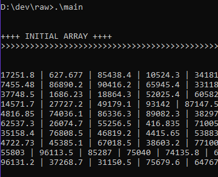

# Clustering Bubble Sort - Implementation 
Bubble Sort implementation using clustering with K-Means and threading

---

* You need to install LLVM (clang++) and make in order to be able to compile this project

---

## How to run?

### 1. Make sure you have LLVM and Make installed on your system:

  * Clang:
  ```Shell
  > clang++ -v
  ```
  You have to get something similar to:
  
  > 
    clang version 11.0.0
    Target: x86_64-pc-windows-msvc
    Thread model: posix
    InstalledDir: C:\Program Files\LLVM\bin
  
  * Make:
  ```Shell
  > make -v
  ```
  Result:
  >
    GNU Make 3.81
    Copyright (C) 2006  Free Software Foundation, Inc.
    This is free software; see the source for copying conditions.
    There is NO warranty; not even for MERCHANTABILITY or FITNESS FOR A
    PARTICULAR PURPOSE.

    This program built for i686-pc-msys
    
### 2. To build the project just run make:
  ```Shell
  > make
  ```
  If everything is OK, you must see NO error messages.
  
### 3. To start the program execute:
  * On Windows:
  ```Shell
  > .\main
  ```
  * On Linux:
  ```Shell
  > ./main
  ```
  
  The output have to be similar to this:
 
 
  
### 4. To clean run:
 ```Shell
 > make clean
 ```
